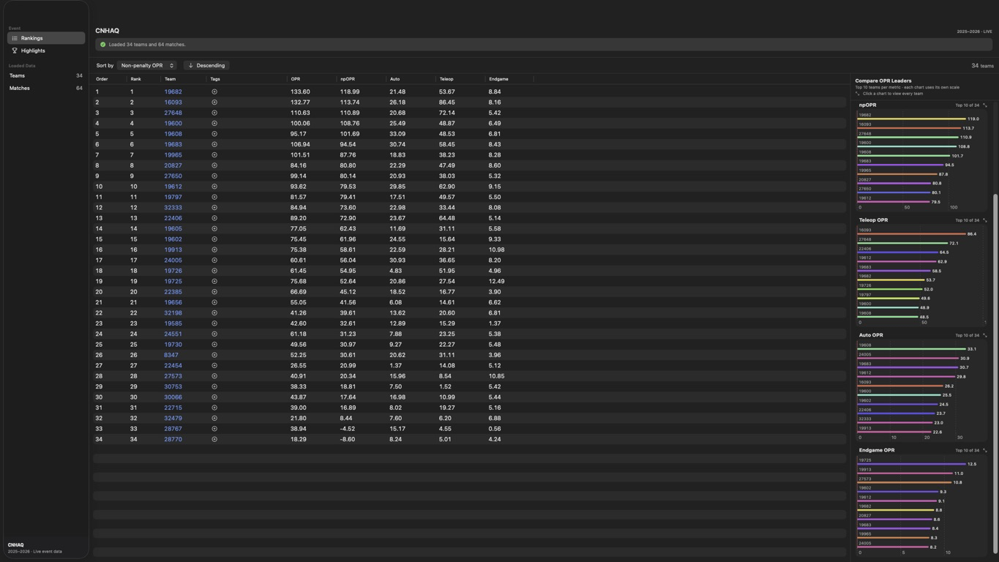
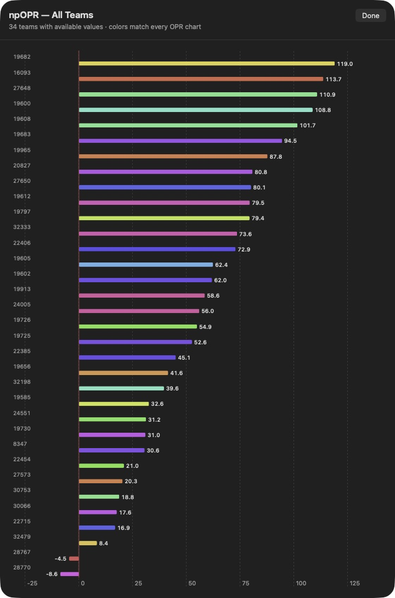

<p align="center">
  
</p>

<h1 align="center">FTC Event Scout</h1>

<p align="center">
  A native macOS app that turns FIRST Tech Challenge event data into sortable OPR rankings, score highlights, and match-level scouting views.
</p>

<p align="center">
  <a href="https://github.com/Sakzyo/FTC_Event_Scout/releases/latest/download/FTC-Event-Scout-1.0.0.dmg"></a>
</p>

<p align="center">
  
</p>

<p align="center">
  <sub>Live rankings and color-coded OPR comparisons for every team at an event.</sub>
</p>

**FTC Event Scout** is a native **macOS scouting app** for exploring FIRST Tech Challenge events. It combines live rankings, comparative OPR charts, score highlights, team match history, detailed score breakdowns, and locally stored scouting tags in a SwiftUI interface.


## Features

- **Live event rankings.** Choose an FTC season, enter an event code, and load every registered team and scored match from FIRST Events.
- **Sortable performance table.** Rank teams by official rank, team number, total OPR, calculated OPRc, non-penalty OPR (npOPR), Auto OPR, Teleop OPR, or Endgame OPR in either direction.
- **Interactive OPR charts.** Compare the top 10 teams for OPR, npOPR, Teleop, Auto, and Endgame beside the rankings table. Every metric is ordered from highest at the top to lowest at the bottom.
- **OPRc match predictions.** Recalculate a residual-filtered offensive-power estimate from completed matches, then compare expected alliance scores, winner, signed margin, and data quality for every upcoming match.
- **Full-event chart drill-down.** Click any compact graph to open a scrollable chart containing every team with an available value. Each team has a distinct color that remains consistent across metrics.
- **Team match history.** Click a team number to inspect every event appearance, alliance partners, opponents, final and non-penalty scores, and the selected team's win/loss result.
- **Detailed score breakdowns.** Expand a match to compare red and blue alliance scoring by season-specific Auto, Teleop, Endgame, and penalty categories.
- **Event highlights.** Surface the highest final, non-penalty, Auto, and Teleop alliance scores, including ties and the teams responsible.
- **Local scouting tags.** Add reusable, color-coded notes to teams and see them in rankings, highlights, and match history. Tags stay on the Mac.
- **Pre-event previews.** If an event has not started, use FTCScout history to compare the registered teams' strongest prior-season OPR results.


## Feature tour

### Compare every OPR metric at a glance

The Rankings view keeps the sortable team table and five compact bar charts visible together. Direct value labels make the charts readable without hovering, while stable team colors make it easier to follow the same team from OPR to npOPR, Auto, Teleop, and Endgame.

Use the **Sort by** menu or a table header to change the ranking, then click any chart to move from its top-10 summary to the complete event field.

### Open a complete event chart

<p align="center">
  
</p>

The expanded chart includes every team with available data, exact values, negative-value handling, and the same cross-metric team colors used in the compact charts.

### Follow a typical scouting workflow

1. Select the season in the toolbar and enter the FIRST event code.
2. Sort the Rankings table by the metric that matters to your scouting question.
3. Compare the compact graphs or click one to inspect the whole-event distribution.
4. Click a team number to open its match history, then expand **Score Breakdown** for alliance-level detail.
5. Use the add-tag control to record traits such as `Strong Auto`, `Consistent`, or `Watch Defense`; reuse the same tag for other teams at that event.
6. Open **Highlights** in the sidebar to find the matches and alliances behind the event's best scores.


## How it works

Choose a season and enter an event code; a loopback-only Python helper fetches FIRST Events data, generates CSVs, and calculates least-squares OPR estimates for total, non-penalty, autonomous, teleop, and endgame performance. The Swift calculation layer also derives OPRc and upcoming-match predictions once whenever refreshed event data is loaded. The app turns those results into sortable tables so scouts can compare teams and inspect individual matches.

The visible application is entirely native SwiftUI, while the Python helper uses only the standard library and listens on `127.0.0.1`. FIRST Events credentials are stored in private app data on the Mac; the unencrypted token file is restricted to the current user. When an event has not started, FTCScout data provides a historical preview of its registered teams.


## OPRc match predictions

**OPR (Offensive Power Rating)** estimates each team's offensive contribution by solving the alliance-score equations `A × x ≈ b` with least squares. FTC Event Scout's prediction layer uses a deterministic one-sided Jacobi SVD, which provides a Moore–Penrose least-squares result without directly inverting a matrix and remains defined for rank-deficient schedules.

**OPRc (Offensive Power Rating – Calculated)** is this project's robust OPR variant. FIRST Events supplies alliance-level final scores, not trustworthy individual robot scores, so this repository uses alliance OPR residuals as the outlier observations (`x`):

1. Keep unique matches only when both alliances have finite final scores and valid team lists.
2. Calculate baseline OPR from all valid completed-alliance observations.
3. For each alliance, calculate `residual = actual score − predicted score`.
4. Calculate Q1 and Q3 with R-7 linear interpolation and `IQR = Q3 − Q1`.
5. Remove an alliance observation only when its residual is strictly outside:
   - lower: `x < Q1 − 1.5 × IQR`
   - upper: `x > Q3 + 1.5 × IQR`
6. Recalculate OPR once from the retained observations to produce OPRc. The filter is not iterated.

Values exactly on either boundary remain. At least four valid alliance observations are required before filtering; smaller samples keep all observations and are marked as limited data. Repeated values and an IQR of zero are handled by the same strict boundary rule.

For an upcoming match, each alliance's expected score is the sum of its members' OPRc values. The predicted margin is `red − blue`, so positive favors Red, negative favors Blue, and zero is a tie. A prediction is unavailable when any scheduled team lacks an OPRc; it is marked limited when the sample is small, a team has fewer than two retained appearances, or the schedule matrix is rank deficient. OPRc does not invent win probabilities.

OPR and OPRc are scouting estimates, not official FTC rankings. Their additive model cannot fully represent alliance interaction, defense, penalties, strategy, robot failures, schedule strength, or other nonlinear match effects. Residual filtering reduces the influence of some abnormal scores but does not make a prediction certain.


## Getting started

### Installation

1. Use macOS 14 or later and make sure Python 3 is installed.
2. Download the [latest release](https://github.com/Sakzyo/FTC_Event_Scout/releases/latest/download/FTC-Event-Scout-1.0.0.dmg).
3. Open the downloaded DMG and drag **FTC Event Scout** into **Applications**.
4. Launch the app and enter your FIRST Events API username and token.

Version 1.0.0 is ad-hoc signed and not notarized. If macOS blocks the first launch, open **System Settings → Privacy & Security** and choose **Open Anyway**.

### Development

Development requires macOS 14+, Xcode with Swift 5.10+ support, and Python 3; loading live data also requires FIRST Events API credentials.

```sh
git clone https://github.com/Sakzyo/FTC_Event_Scout.git
cd FTC_Event_Scout
./script/build_and_run.sh
```

The script builds the `FTCEventScout` executable target, assembles `dist/FTC Event Scout.app`, ad-hoc signs it, and launches it.

For build-only workflows:

```sh
./script/package_app.sh debug
./script/package_app.sh release
```

To create the release app, compressed GitHub release DMG, and SHA-256 checksum:

```sh
./script/package_dmg.sh
```


## Repo layout

```text
FTC_Event_Scout/
├── Package.swift                    ← SwiftPM manifest and FTCEventScout target
├── Sources/FTCEventScout/           ← native macOS application
│   ├── App/                         app entry point, scenes, and commands
│   ├── Models/                      event records and observable app state
│   ├── Services/                    backend, API, CSV, credentials, tags, preferences
│   ├── Support/                     shared formatting helpers
│   ├── Views/                       rankings, highlights, match history, settings
│   │   └── Components/              reusable SwiftUI components
│   └── Resources/                   localized strings
├── script/                          ← build, package, launch, and icon tooling
├── web_server.py                    loopback JSON service used by the app
├── scrape.py                        FIRST Events client and match CSV export
├── score_breakdown.py               season-specific score detail normalization
├── historical_opr.py                FTCScout pre-event history client
├── calculate_opr_from_csv.py        OPR metric preparation and CSV export
├── opr_calc.py                      standard-library least-squares solver
├── event_results/                   bundled seed match-detail CSVs
├── events_teams_opr/                bundled seed OPR CSVs
├── tests/                            Swift model/UI support tests and Python score tests
└── docs/assets/                     README icon and current feature captures
```
